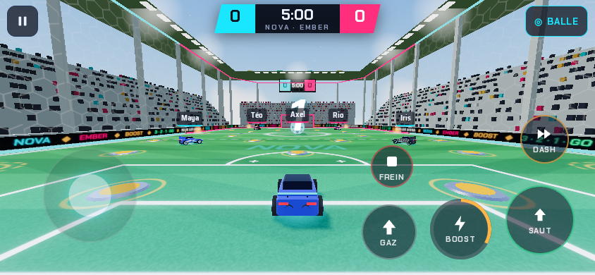
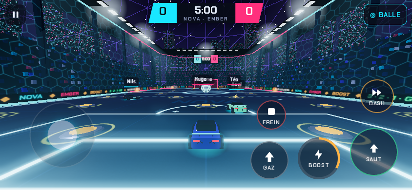
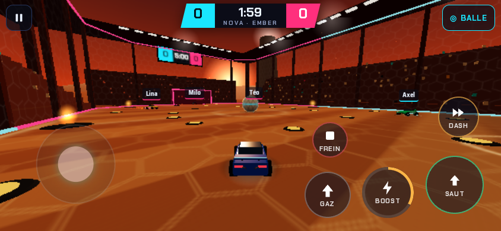
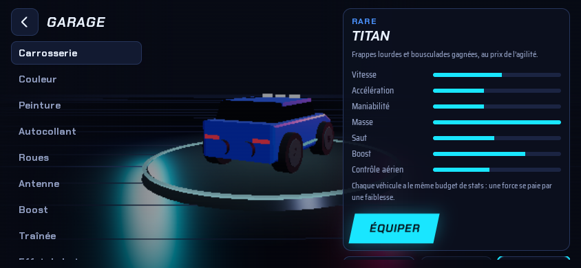

# NEON CAR ARENA

Jeu mobile de **football automobile arcade** : des voitures, une balle géante, deux buts, du boost et des bots.
Identité, véhicules, arènes, interface et effets originaux (aucun élément repris d’un jeu existant).



| Neon Dome | Desert Reactor | Garage |
|---|---|---|
|  |  |  |

## Jouer tout de suite

| Format | Fichier | Comment |
|---|---|---|
| **HTML** | [`release/NeonCarArena.html`](release/NeonCarArena.html) | Un seul fichier autonome (≈ 0,8 Mo, fonctionne hors ligne). Ouvrez-le dans Chrome, Edge, Firefox ou Safari, sur ordinateur ou téléphone (mode paysage). |
| **APK Android** | [`release/NeonCarArena.apk`](release/NeonCarArena.apk) | Android 5.0+ (API 21), GPU compatible OpenGL ES 3.0 / WebGL 2. Téléchargez-le sur le téléphone, autorisez « Installer des applis inconnues », puis ouvrez-le. |

L’APK est signé avec une clé de **développement** (incluse dans le dépôt) pour que les versions suivantes s’installent par-dessus. Pour une publication sur le Play Store, créez votre propre clé privée (voir plus bas).

## Ce qui est jouable

Boucle complète : **menu → match → pilotage → physique → balle → but → score → fin de match → résultats → menu**.

- **Modes** : Match rapide 3v3, Duel 1v1, Chaos 4v4, Tournoi (quart / demi / finale, élimination directe), Entraînement (terrain libre, tirs, aériens, dribble, contrôle de balle).
- **Match** : 2, 3 ou 5 minutes, compte à rebours, but quand la balle franchit entièrement la ligne, ralenti + explosion + annonce, **replay automatique du but** (passable), engagement automatique, prolongation « but en or » en cas d’égalité, buzzer qui attend que la balle touche le sol, écran de résultats (points, buts, passes décisives, arrêts, tirs, MVP).
- **Voiture** : accélérer, freiner, marche arrière, tourner, sauter (saut maintenu plus haut), double saut, **dash** directionnel (salto avant/arrière/latéral) au sol ou en l’air, boost au sol et en l’air (aériens), rotation en l’air (tangage/lacet), démolitions à vitesse supersonique, redressement automatique.
- **Physique arcade maison** (pas de moteur externe) : pas fixe 120 Hz, masse, accélération, vitesse max, frottements, adhérence latérale, suspension ressort-amortisseur (tangage, roulis, compression à l’atterrissage), collisions voiture/voiture et voiture/balle avec impulsion « arcade » lisible, balle avec masse, rebonds, roulement, effet et inertie, arène avec coins coupés, poteaux et transversale arrondis.
- **Boost** : jauge 0–100, 6 grandes capsules (100) et 24 petites (+12) qui réapparaissent, flammes, particules, traînée et son.
- **Bots** (4 niveaux : Facile, Moyen, Difficile, Expert) : prédiction de trajectoire de la balle, interception, rôles dynamiques attaquant / soutien / défenseur (y compris avec vous comme coéquipier), rotations, retour au but, gardien, arrêts, dégagements, passes centrées, sauts, dashs, aériens (Difficile/Expert), récupération de boost, anti-blocage. Les niveaux diffèrent en temps de réaction, précision, anticipation, vitesse, usage du boost et discipline de placement.
- **3 arènes** : Neon Dome (nuit, dôme de verre, skyline), Desert Reactor (coucher de soleil, dunes, réacteurs), Sky Stadium (stade dans les nuages). Tribunes avec foule animée, écrans géants avec le score, rampes lumineuses aux couleurs des équipes, flash dynamique au but.
- **6 véhicules** au même budget de stats : Pulse (équilibrée), Vortex (rapide et légère), Titan (lourde et puissante), Phantom (très maniable), Comet (aérienne), Raptor (agressive).
- **Garage** : carrosserie, couleur, peinture (mat, métallisé, carbone, nacré, néon, chrome), autocollants, roues, antenne, effet de boost, traînée, effet de but, son moteur, titre. Raretés Commun / Rare / Épique / Légendaire. **Uniquement cosmétique**, aucune boutique, aucun achat.
- **Progression** : XP par match (participation, victoire, buts, passes, arrêts, tirs, MVP, multiplicateur de difficulté), **50 niveaux**, une récompense à chaque niveau (voitures, couleurs, roues, effets, titres…).
- **Profil et statistiques** : niveau, matchs, victoires, buts, passes, arrêts, tirs, MVP, démolitions, tournois, temps de jeu.
- **Contrôles tactiles** : joystick flottant à gauche, boutons GAZ, FREIN, SAUT, BOOST, DASH à droite. On peut glisser le pouce d’un bouton à l’autre. Réglages : sensibilité, inversion de l’axe vertical, mode gaucher, vibrations, accélération automatique (jeu à une main), taille des boutons et du joystick, **éditeur de disposition** par glisser-déposer.
- **Caméra** : troisième personne, caméra balle ou libre (bouton BALLE), aide à la caméra, effet de vitesse au boost, anti-traversée des murs, caméra de but et de replay. Réglages : distance, hauteur, champ de vision, réactivité, secousses.
- **Audio 100 % synthétisé** (aucun fichier) : moteur selon la vitesse, boost, chocs, balle, rebonds, horn de but, foule qui réagit, bips de départ, musique synthwave originale dans les menus.
- **Graphismes** : qualité BASSE / MOYENNE / HAUTE, détection automatique selon le GPU du téléphone, puis baisse automatique si les FPS chutent ; limite 30/60 FPS ; compteur de FPS optionnel.
- **Écrans** : 16:9, 18:9, 20:9 et plus, encoches gérées (CSS `env(safe-area-inset-*)` + valeurs envoyées par l’app Android).
- **Sauvegarde locale** : progression, niveau, XP, objets débloqués, personnalisation, paramètres, statistiques, tournoi en cours. Export / import par code texte.

## Commandes

| Action | Tactile | Clavier | Manette |
|---|---|---|---|
| Direction / rotation en l’air | Joystick gauche | ZQSD / WASD / flèches | Stick gauche |
| Accélérer / freiner-reculer | GAZ / FREIN | Z-W / S (ou flèches) | RT / LT |
| Saut (2× = double saut) | SAUT | Espace | A |
| Boost | BOOST | Maj | B / RB |
| Dash (direction du joystick) | DASH | E | X |
| Caméra balle | BALLE (en haut à droite) | C | Y |
| Pause | ⏸ | Échap / P | Start |

## Technologie

**Pourquoi pas Unity ?** L’environnement où ce projet a été produit n’a ni éditeur Unity ni licence, et ne peut pas compiler un projet Unity : un projet Unity livré ici n’aurait jamais été testé. J’ai donc choisi la meilleure alternative réellement exécutable et vérifiable :

- **Three.js (WebGL)** pour le rendu 3D, tout le reste écrit à la main (physique, IA, audio, interface).
- **Un seul fichier HTML** généré par esbuild (JS, CSS et polices intégrés) : fonctionne sans réseau.
- **APK Android** : application native Java minimale qui affiche ce fichier dans une WebView plein écran (paysage, écran allumé, encoche, vibrations natives, bouton retour, pause en arrière-plan).

La simulation n’utilise ni le DOM ni WebGL : elle tourne aussi sous Node.js (tests automatiques, futur serveur de jeu).

## Compiler

```bash
npm install
npm test            # tests headless rapides (physique + un match de bots)
npm run sim         # tests complets (plusieurs matchs de bots, équilibrage)
npm run build       # → dist/index.html (+ dist/artifact.html)
npm run dev         # rebuild automatique à chaque modification
npm run android     # build + APK signé → release/NeonCarArena.apk
npm run release     # met à jour release/NeonCarArena.html et l’APK
```

APK : JDK 17+ et SDK Android (API 35, build-tools 35) requis ; le script cherche `ANDROID_HOME`, `/opt/android-sdk` ou `~/Android/Sdk`. Le projet `android/` s’ouvre aussi dans Android Studio.

**Clé de publication** : remplacez `signingConfigs.dev` dans `android/app/build.gradle` par votre propre keystore (`keytool -genkeypair …`) gardé hors du dépôt. La clé `android/keystore/neon-dev.jks` est publique et ne doit servir qu’au développement.

## Architecture

Détails dans [docs/ARCHITECTURE.md](docs/ARCHITECTURE.md). Correspondance avec les systèmes demandés :

| Système | Fichier |
|---|---|
| VehicleController | `src/game/VehicleController.js` |
| VehiclePhysics | `src/game/VehiclePhysics.js` |
| BallController | `src/game/BallController.js` |
| BoostSystem | `src/game/BoostSystem.js` |
| MobileInput | `src/input/MobileInput.js` (+ `InputRouter.js`, `KeyboardInput.js`) |
| CameraController | `src/render/CameraController.js` |
| MatchManager | `src/game/MatchManager.js` |
| GoalManager | `src/game/GoalManager.js` |
| ScoreManager | `src/game/ScoreManager.js` |
| BotAI | `src/ai/BotAI.js` |
| GarageSystem | `src/meta/GarageSystem.js` |
| CustomizationSystem | `src/meta/CustomizationSystem.js` (+ catalogue `Catalog.js`) |
| UIManager | `src/ui/UIManager.js` (+ `HUD.js`) |
| AudioManager | `src/audio/AudioManager.js` |
| SaveSystem | `src/meta/SaveSystem.js` |

## Limites connues (honnêtes)

- **Pas de multijoueur en ligne** pour l’instant. L’architecture est prête (simulation déterministe à pas fixe, sans rendu, entrées sérialisables, snapshots d’état déjà utilisés par les replays) ; le serveur, le matchmaking, les salons, les amis et le classement restent à écrire. Voir `docs/ARCHITECTURE.md`.
- **Pas de sauvegarde cloud** : l’interface de stockage est prévue (`LocalStorageBackend` / `MemoryBackend`), seul le stockage local existe. L’export/import par code permet déjà de transférer une progression.
- Les voitures ne roulent pas sur les murs ni le plafond (elles rebondissent dessus).
- La suspension est un ressort-amortisseur global (tangage, roulis, compression), pas quatre roues indépendantes.
- Modèles 3D procéduraux low-poly et sons synthétisés : lisibles et légers, mais à remplacer par des assets d’artistes pour une version commerciale.
- L’APK a été compilé et vérifié (signature, manifeste, contenu) mais cet environnement ne permet pas de lancer un émulateur Android. Le jeu lui-même a été testé dans Chromium (même moteur que la WebView Android) en viewport mobile avec de vrais événements tactiles multi-doigts.
- iOS : le fichier HTML se joue dans Safari ; il n’y a pas d’application iOS native.

## Licences

Code du jeu : voir le dépôt. Three.js : MIT. Polices intégrées Chakra Petch et Saira Semi Condensed : SIL Open Font License 1.1.
