# Asphalt Legends Unite — Fangame (Godot + Blender)

Fangame de course arcade **non officiel** inspiré d'*Asphalt Legends Unite*, fait avec **Godot 4.5** et **Blender 4.2**.
Tous les modèles 3D (voitures, trafic, rampes, palmiers…) sont générés par des scripts Blender, et les pistes sont générées procéduralement dans Godot.

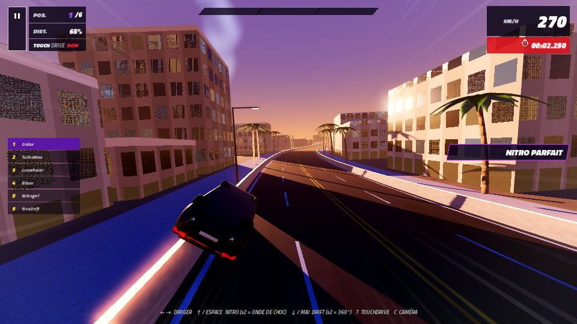

| Accueil | Carrière | Carte de saison |
|---|---|---|
| 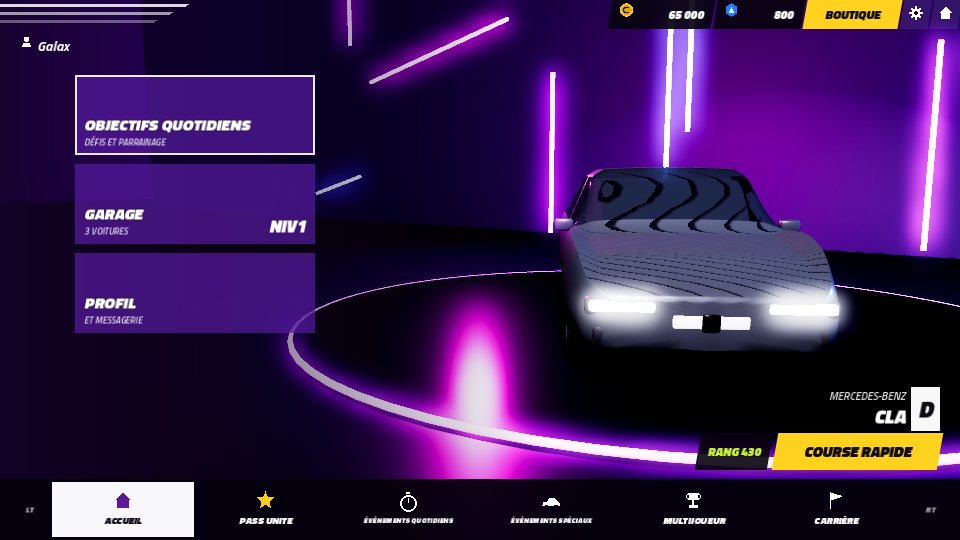 | 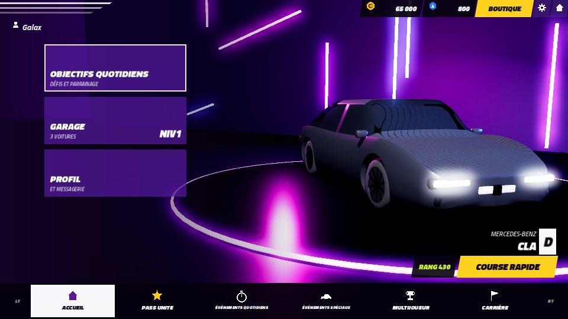 | 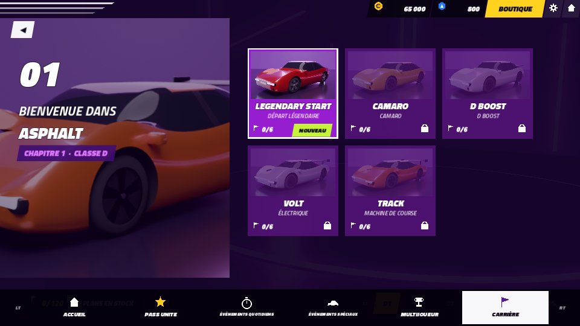 |
| **Sélection de voiture** | **Fiche voiture** | **Résultats** |
| 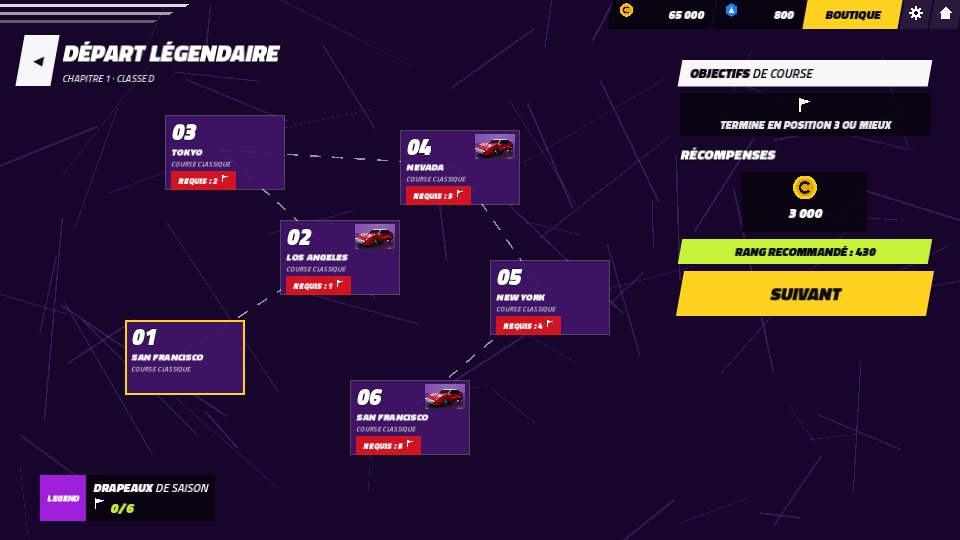 | 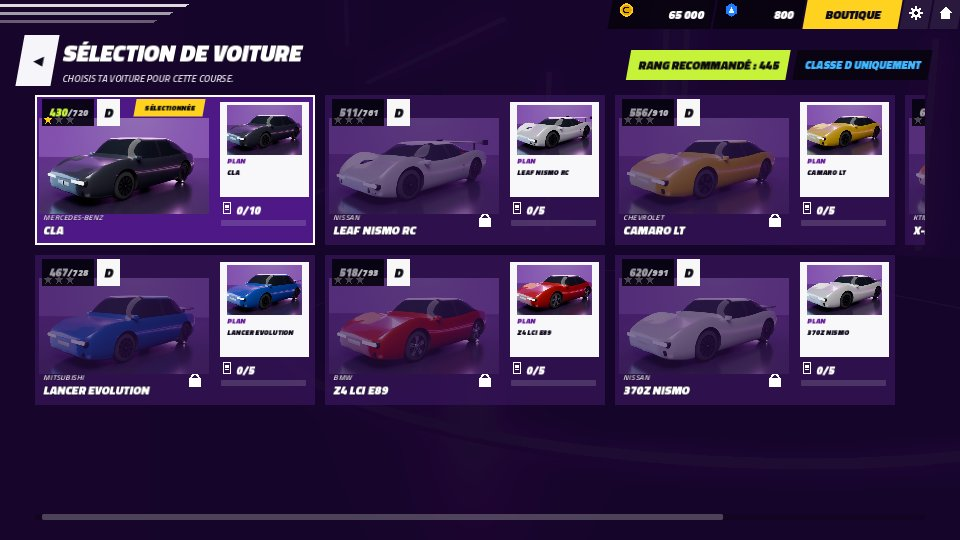 | 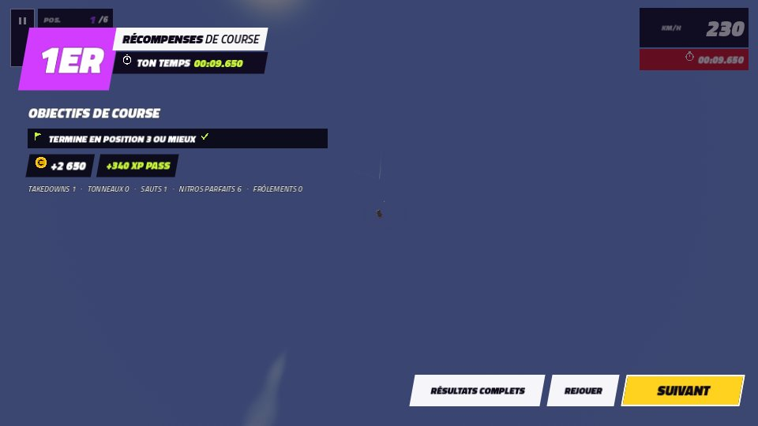 |
| **Tokyo (nuit, route mouillée)** | **New York (crépuscule)** | **Nevada** |
| 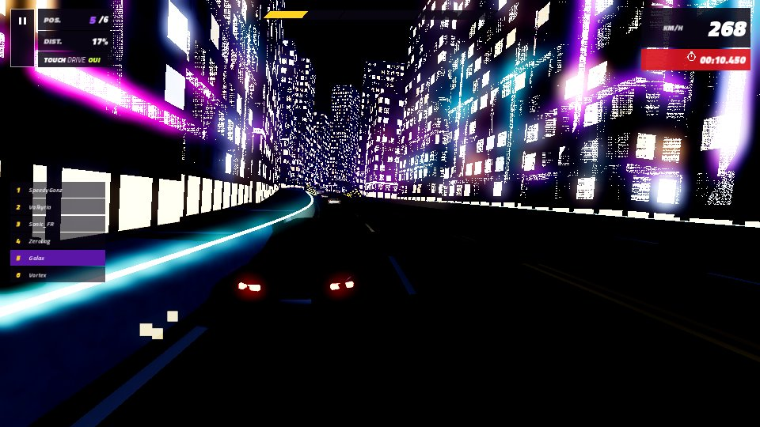 | 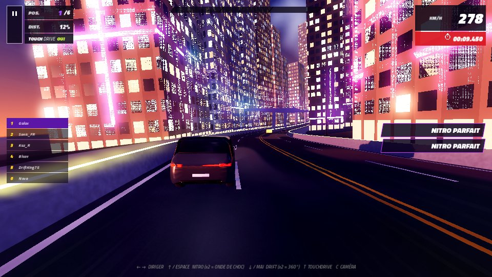 | 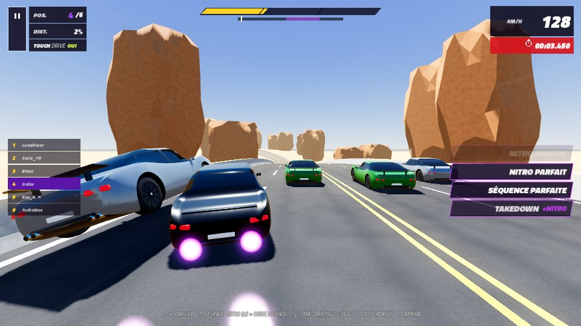 |

> Les captures ont été faites avec le rendu logiciel « Compatibility » (sans SSAO/SSR/ombres douces). Sur un vrai PC avec le rendu Forward+, c'est plus joli.

## Jouer

### Sur PC Windows (.exe)
Télécharge `AsphaltFangame.exe` et double-clique dessus. Tout est dans ce seul fichier (pas d'installation).
Windows SmartScreen peut afficher « Windows a protégé votre ordinateur » car le fichier n'est pas signé : clique sur **Informations complémentaires → Exécuter quand même**.

### Sur téléphone Android (.apk)
1. Télécharge `AsphaltFangame.apk` directement sur le téléphone : https://github.com/foollboss/fangame-mario-avec-mistral/releases/download/jeu/AsphaltFangame.apk
2. Ouvre-le et autorise l'**installation d'applications inconnues** quand Android le demande.
3. Lance « Asphalt Fangame ». Le jeu se joue en paysage, avec le TouchDrive activé par défaut.

**« Application non installée » ?** Une ancienne version d'Asphalt Fangame est déjà installée et elle a été signée avec une autre clé (chaque version générée par GitHub a sa propre clé pour l'instant). Android refuse alors la mise à jour. Désinstalle l'ancienne version (**Paramètres → Applications → Asphalt Fangame → Désinstaller**, et aussi la version de diagnostic si tu l'as installée), puis rouvre l'APK. La progression du jeu est effacée par la désinstallation.

Commandes tactiles : **◀** au milieu à gauche avec **DRIFT** en dessous (double tape = 360°), **▶** au milieu à droite avec **NITRO** en dessous (zone bleu clair = parfait, double tape jauge pleine = onde de choc, zone turquoise = ultra nitro), cadre « TOUCHDRIVE » en haut à gauche pour l'activer ou le désactiver, bouton retour d'Android = pause / écran précédent. On peut appuyer sur deux boutons en même temps (◀ + NITRO par exemple).
Il faut un téléphone Android 7 ou plus récent, 64 bits et compatible OpenGL ES 3 (quasiment tous les téléphones depuis 2016).

Si le jeu se ferme tout seul :
1. Relance-le, va dans **Réglages → Journal des erreurs** et fais une capture d'écran : tu y vois le « dernier signe de vie » de la partie précédente (écran, temps de jeu, mémoire) et les dernières lignes du journal.
2. Essaie `AsphaltFangame-diagnostic.apk` (page de téléchargement) : cette version ne se ferme pas sur une erreur de script, elle l'écrit dans le journal.
3. Un plantage du pilote graphique ou un manque de mémoire ne laisse pas de trace dans le journal : seul `adb logcat` (sur un PC) le montre.

### Où trouver les fichiers
- Dernière version : page **Releases** du dépôt → « jeu » (https://github.com/foollboss/fangame-mario-avec-mistral/releases/tag/jeu), avec `AsphaltFangame.exe`, `AsphaltFangame.apk` et `AsphaltFangame-diagnostic.apk`.
- Ils sont générés automatiquement par GitHub à chaque modification du dossier `godot/` (onglet **Actions** → « Export du jeu » → section **Artifacts**).
- Tu peux aussi les générer toi-même : ouvre le projet dans Godot 4.5 → *Projet → Exporter* → « Windows Desktop » ou « Android » (les préréglages sont déjà prêts dans `godot/export_presets.cfg`).

### Depuis les sources (Godot)
1. Installe **Godot 4.5** (version standard, pas besoin de .NET) : https://godotengine.org/download
2. Ouvre Godot → **Importer** → choisis `godot/project.godot`.
3. Le premier import des modèles prend quelques secondes, puis appuie sur **F5** (▶).

## Ce qu'il y a dedans

**Course**
- Accélération automatique, **drift** (remplit la nitro), **nitro** comme dans Asphalt Legends Unite, avec des **zones dans la jauge** :
  - 1 appui = nitro normal (flammes orange) : la jauge se vide et une **zone bleu clair** apparaît dedans
  - ré-appuyer quand le bord de la jauge est dans la zone bleu clair = **NITRO PARFAIT** (flammes bleu clair, 3 d'affilée = *SÉQUENCE PARFAITE*)
  - jauge pleine (elle clignote en violet) + double appui = **ONDE DE CHOC** (flammes violettes, éjecte le trafic)
  - pendant l'onde de choc, une **zone turquoise** apparaît : appuie dedans pour l'**ULTRA NITRO** (flammes turquoise) — encore plus rapide que l'onde de choc, une explosion éjecte le trafic et les rivaux proches, et tout contact élimine l'adversaire. Un appui trop tôt pendant l'onde de choc fait rater l'ultra.
- **Rampes** et **rampes à tonneau** (inclinées : la voiture fait un **tonneau** en l'air), sauts sur les bosses de San Francisco, **360°** (double appui sur drift).
- **Takedowns** (pousse les rivaux sur le côté ou percute-les par l'arrière), **épaves** au ralenti avec réapparition, **frôlements** de trafic.
- 5 adversaires IA (changements de voie, rampes, nitro, agressivité, élastique) + trafic civil (berlines, taxis, SUV, vans, bus).
- Séparations de voies sous autoroute surélevée, tunnels, arches START/FINISH, damier d'arrivée.
- **TouchDrive** (pilotage assisté, touche T), 3 caméras (touche C), commandes tactiles sur mobile.
- Moteur synthétisé en temps réel (le son suit les rapports), effets sonores et musique synthwave générés par le code.

**5 villes** générées procéduralement (chaque course est différente) : San Francisco (collines, rails de tram, maisons victoriennes), Los Angeles (coucher de soleil, palmiers), Tokyo (nuit, néons, route mouillée), Nevada (désert, mesas), New York (crépuscule, gratte-ciel, taxis).

**Menus façon Asphalt Legends Unite** : Accueil avec showroom 3D néon, Carrière (5 chapitres, 20 saisons, 120 courses avec drapeaux, « REQUIS : n », objectifs, plans en récompense, rang recommandé), Sélection de voiture, Fiche voiture (Vitesse max / Accélération / Maniabilité / Nitro, rang, AMÉLIORER, peinture), Garage, Boutique, Événements spéciaux, Objectifs quotidiens, Pass Unite (30 paliers), Multijoueur (contre des bots, ligues), Profil, Réglages. Sauvegarde automatique.

## Voitures

Les **3 voitures gratuites** de départ : **Mercedes-Benz CLA (classe D)**, **Peugeot 3008 (classe C)**, **BMW M5 (classe B)**.

| Classe | Voitures |
|---|---|
| D | Mercedes-Benz CLA (gratuite), Mitsubishi Lancer Evolution, BMW Z4 LCI E89, Chevrolet Camaro LT, Nissan Leaf Nismo RC, Nissan 370Z Nismo, KTM X-Bow GTX |
| C | Peugeot 3008 (gratuite), Alpine A110 S, Porsche 718 Cayman GT4, Ford Mustang GT |
| B | BMW M5 (gratuite), Audi R8 V10, Nissan GT-R Nismo, Mercedes-AMG GT R, Porsche 911 GT3 RS |
| A | Lamborghini Huracán EVO, Ferrari F8 Tributo, McLaren 720S, Porsche 918 Spyder |
| S | Lamborghini Revuelto, Rimac Nevera, Bugatti Chiron, Koenigsegg Jesko |

On les débloque avec des **plans** (carrière, Pass, boutique) ou en les achetant. Chaque voiture a des étoiles et des niveaux d'amélioration qui augmentent son rang.
Pour ajouter / modifier une voiture : édite `godot/data/cars.json` puis relance le script Blender.

| Peugeot 3008 | Mercedes-Benz CLA | BMW M5 |
|---|---|---|
| 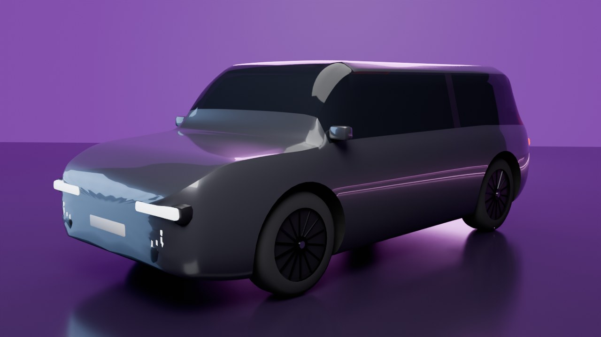 | 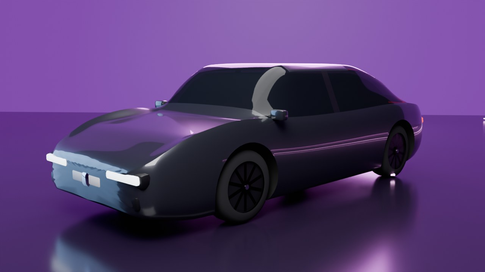 | 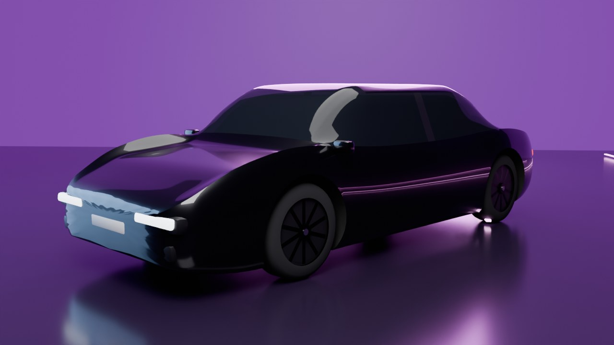 |

## Commandes

| Action | Clavier (AZERTY ou QWERTY) | Manette |
|---|---|---|
| Diriger | ← → ou Q / D | Stick gauche, croix |
| Nitro (zone bleu clair = parfait, jauge pleine 2x = onde de choc, zone turquoise = ultra) | ↑, Z ou Espace | A, RT |
| Drift / frein (2x = 360°) | ↓, S ou Maj | X / B, LT |
| TouchDrive | T | Select |
| Caméra | C | Y |
| Pause | Échap ou P | Start |
| Onglets du menu | Page préc./suiv. | LB / RB |

## Régénérer les modèles 3D avec Blender

Les fichiers `.glb` et les vignettes sont déjà inclus. Pour les refaire (ou après avoir modifié `cars.json`) :

```bash
blender -b -P blender/build_cars.py                       # toutes les voitures + vignettes (Cycles)
blender -b -P blender/build_cars.py -- --only bmw_m5      # une seule voiture
blender -b -P blender/build_cars.py -- --no-thumbs        # sans rendu des vignettes
blender -b -P blender/build_props.py                      # rampes, palmiers, lampadaires, rochers…
```

Les voitures sont construites par sections (profil de caisse par type : berline, fastback, SUV, coupé, supercar…), avec passages de roues, phares, calandre, rétros, aileron, jantes et étriers. Ce sont des approximations procédurales : tu peux remplacer n'importe quel `godot/assets/cars/<id>.glb` par un vrai modèle, il suffit de garder des objets nommés `Body`, `Wheel_FL`, `Wheel_FR`, `Wheel_RL`, `Wheel_RR` (voiture orientée vers +Y dans Blender) et un matériau `Paint` pour la peinture personnalisable.

## Structure

```
blender/            scripts de génération des modèles (voitures, décors)
godot/
  data/cars.json    voitures, classes, stats, rangs
  scenes/           hub.tscn (menus) et race.tscn (course)
  scripts/autoload  game.gd (données, sauvegarde, carrière, économie), audio.gd (sons procéduraux)
  scripts/race      track.gd (pistes), racer.gd (physique + IA), traffic.gd, race_camera.gd, hud.gd, race.gd
  scripts/hub       hub.gd (showroom 3D + tous les écrans)
  shaders/          route, façades d'immeubles, lignes de vitesse
  assets/           modèles .glb, vignettes, police Titillium Web (licence OFL)
```

## Mentions

Fangame gratuit, non officiel et sans but commercial, fait par des fans. *Asphalt* est une marque de Gameloft ; les noms des voitures appartiennent à leurs constructeurs respectifs. Aucun asset du jeu original n'est utilisé : tout est généré par le code. Police : Titillium Web (SIL Open Font License, voir `godot/assets/fonts/OFL.txt`).
